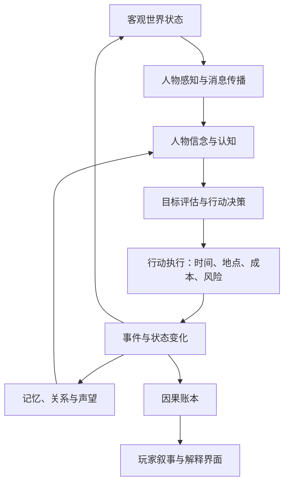

# 《汉末浮生》游戏设计文档

> 文档性质：世界模拟核心设计（初稿）  
> 版本：0.1  
> 日期：2026-07-23  
> 当前目标：定义一台能够持续运行、允许个人介入、能够解释自身因果的汉末历史世界机器。

---

## 1. 项目定义

### 1.1 一句话描述

《汉末浮生》是一款以汉末三国为背景、以个人为观察和行动尺度的动态历史模拟游戏。玩家不是一个势力的化身，而是世界中的一个具体人物；天下在玩家之外持续运转，玩家的行动通过统一规则进入世界，并在时间中形成可追溯的后果。

### 1.2 核心体验

玩家应当持续感受到四件事：

1. **天下不等我**：人物会迁移、势力会兴亡、机会会出现也会消失。
2. **我身在其中**：所在地、身份、关系、消息来源决定我能看到什么、做什么。
3. **事情有来由**：灾荒、叛乱、战争、背叛和升迁都能追溯到实际原因。
4. **行动会生根**：今天的一次救助、欺骗、交易或延误，可能在数月乃至数年后改变别人的选择。

### 1.3 本项目不是什么

- 不是把《太阁立志传》的系统换成三国人物和地图。
- 不是以统一天下为唯一目标的传统君主制战略游戏。
- 不是依靠大量随机事件弹窗伪装成动态世界。
- 不是让生成式 AI 临时编写结果、无法复现的文字冒险。
- 不是追求对每粒粮食、每名百姓进行无意义的微观模拟。

### 1.4 设计成功的判据

游戏是否成功，不由地图大小或历史人物数量决定，而由以下问题决定：

- 玩家完全不介入时，世界能否稳定运行并产生合理变化？
- 同一个初始局面在不同选择下，能否形成不同但可解释的历史？
- 玩家是否能以普通人的身份获得有意义的生活，而不是只能等待成为君主？
- 一个重大结果是否能回答“谁做了什么、为什么做、条件从何而来”？
- 世界规则对玩家和 NPC 是否基本一致？

---

## 2. 对当前六项关注点的判断

现有六项判断是正确的，而且已经覆盖了世界模拟最核心的骨架：

| 已提出的关注点 | 在系统中的位置 | 需要补充的关键问题 |
|---|---|---|
| 历史还原 | 初始世界与规则约束 | 资料可信度、冲突史料、未知部分、史实与玩法抽象的边界 |
| 时间 | 一切变化的共同坐标 | 时间粒度、同时发生、行动中断、日程、季节与延迟结果 |
| 空间 | 行动发生的实际场所 | 层级、道路网络、进入权限、空间容量、可见范围 |
| 人物坐标轴 | 行动主体 | 认知、记忆、关系、处境、组织身份、动态需求 |
| 因果系统 | 世界连续性的保证 | 事件日志、原因引用、延迟影响、反馈循环、解释工具 |
| 其他 | 世界能够自运转的必要支柱 | 信息、经济、组织权力、统一行动、NPC 决策和表现层 |

需要新增的六个一级系统是：

1. **信息与认知**：世界真相和人物所知必须分离。
2. **资源与经济**：粮食、金钱、人口和物资必须有来源、去向和运输过程。
3. **组织与权力**：官职、军队、宗族和势力内部不能被简化为一个颜色块。
4. **统一行动规则**：玩家与 NPC 应通过同一套行为改变世界。
5. **NPC 决策**：人物必须根据自身目标、认知和处境行动。
6. **可读性与解释**：再真实的模拟，如果玩家无法理解，就不能形成游戏体验。

---

## 3. 世界宪法

“世界宪法”是所有内容和系统都不能违反的基础规则。第一版暂定如下。

### 3.1 十条不变量

1. **任何行动都发生在具体时间和具体地点。**
2. **任何有意义的行动都消耗时间，并可能消耗物资、金钱、人情、健康或机会。**
3. **人物只能依据自己掌握的信息作出决定，不能读取全局真相。**
4. **资源不能凭空产生或消失，必须存在来源、储存、转移、消耗或损耗。**
5. **权力必须有依据：官职、武力、财富、声望、血缘、知识或他人的承认。**
6. **关系必须来自共同经历、利益、身份或传播的信息，不能只靠无来源的数值改变。**
7. **玩家和 NPC 原则上使用同一套行动与结果规则。**
8. **重大状态变化必须由事件造成，重大事件必须记录其直接原因。**
9. **历史人物可以死亡、失败、改换立场；世界不得为了预定剧情无条件纠正结果。**
10. **模拟精度服务于选择和因果；不会影响选择的细节不进入核心状态。**

### 3.2 世界运行总图



### 3.3 世界真相、人物认知与玩家界面

系统必须区分三层：

- **真相层**：引擎知道的客观状态。
- **认知层**：每个人物认为世界是什么样子，可能过时、残缺或错误。
- **呈现层**：玩家通过亲历、观察、书信、公告和传闻所获得的内容。

例：袁术已经秘密离开南阳是真相；曹操仍认为袁术在南阳是曹操的认知；玩家从行商口中听到“袁术似乎正在东行”是玩家掌握的一条低可信度消息。

---

## 4. 历史还原系统

### 4.1 还原目标

历史还原不是背诵人物年表，而是尽可能准确地重建某个日期的**约束条件**：

- 行政区划与聚落分布
- 城市、关隘、道路、水系和大致距离
- 人物的官职、年龄、所在地和已知关系
- 政权的法理、组织结构和实际控制范围
- 人口、农业、物产、商路、灾害与季节性短缺
- 驻军、征兵能力、治安、地方豪强与民间组织
- 当时已经发生的事件，以及人物当时可能知道的事件

准确的初始条件比强制播放准确的后续剧情更重要。游戏开局之后，历史应由规则继续生成。

### 4.2 史料可信度分级

任何历史数据都应带有来源与置信度，不把推测伪装成精确事实。

| 等级 | 定义 | 处理方式 |
|---|---|---|
| A | 多个高可信来源一致 | 作为硬史实初始化 |
| B | 单一可靠来源或主流研究结论 | 默认采用，保留来源 |
| C | 来源冲突或只能间接推断 | 采用合理方案，并标注可调整 |
| D | 史料空白，需要玩法抽象 | 使用区间、概率或生成规则，不制造虚假精确值 |

例如，若无法确定某县在某月的精确储粮，就不填写“12,438 石”这种假精确数字，而是根据人口、收成、征调和运输能力推导一个区间，再在确定性随机种子下初始化。

### 4.3 历史数据结构

历史资料至少拆为以下数据集：

- `places`：州、郡、县、城、关、渡口、驿站、道路、河段。
- `persons`：生卒、身份、官职、所在地、亲族、重要经历。
- `offices`：官职归属、品秩、职责、任免权和实际权限。
- `polities`：朝廷、地方政权、军阀集团及其法理关系。
- `resources`：物产、农业周期、矿产、盐铁、马匹和运输条件。
- `chronicle`：已经发生的历史事件及其确定性等级。
- `sources`：每项资料的出处、版本、摘录、争议与研究备注。

### 4.4 历史与玩法发生冲突时

采用以下优先级：

1. 不破坏已明确发生的开局前史实。
2. 不违反时代的物质条件与制度边界。
3. 对未知部分使用合理范围，不追求假精确。
4. 为了游戏节奏可以压缩表现，但不能悄悄改变因果。
5. 任何明显抽象都应在资料库或开发说明中可查。

### 4.5 历史事件的“引力”而非脚本

开局后的著名事件使用条件模型：

- **必要条件**：缺失则不能发生。
- **促进条件**：越多越容易以近似史实的形式发生。
- **阻碍条件**：降低发生概率或改变参与者。
- **替代路径**：原事件无法发生时，相关矛盾以其他形式释放。

例如“诸侯讨董”依赖董卓控制朝廷、地方反对力量、檄文传播、领袖关系和后勤可能性。它可以形成，也可以规模缩小、领袖改变、提前瓦解，或者被另一场政变取代。

---

## 5. 时间系统

### 5.1 时间不是墙上不断走的现实秒表

核心要求是**世界时间不会为玩家的角色停止**，而不是强迫玩家在现实时间内操作。

命令行原型采用事件驱动推进：

- 玩家阅读和选择命令时，世界暂停。
- 玩家提交行动后，时间推进对应时长。
- 推进期间，所有人物、组织、运输和计划同时运行。
- 若发生需要玩家处理的中断，时间停在中断点。
- 玩家可以主动等待到某一时刻，但等待期间机会可能消失。

这样既保留时间压力，也允许玩家认真思考和复盘。

### 5.2 内部时间表示

- 引擎内部使用单调递增的整数时间戳，建议最小单位为“分钟”。
- 界面按汉历日期与时辰显示，不直接显示大量分钟数。
- 大多数行动以半个时辰、一个时辰、半日或整日为可感知单位。
- 经济、人口和组织不必每分钟更新，使用分层调度降低成本。

### 5.3 分层更新频率

| 频率 | 适合处理的内容 |
|---|---|
| 即时/事件触发 | 交谈、交易、战斗、到达、死亡、消息送达 |
| 时辰 | 行程、值守、设施开放、疲劳、天气影响 |
| 每日 | 饮食、住宿、伤病、人物日程、道路风险 |
| 每旬 | 军队补给、官署计划、治安、市场趋势 |
| 每月 | 俸禄、税赋、人口迁移、组织评价、长期目标 |
| 每季/年度 | 收成、征兵恢复、年龄、制度性变化 |

### 5.4 行动持续时间

每项行动定义：

```text
开始条件 + 准备时间 + 执行时间 + 恢复时间 + 可中断点
```

例如拜访不只是固定消耗一小时：前往住所、等候通报、对方是否在场、身份礼节和谈话长度都会影响耗时。

### 5.5 同时发生与冲突

当多个行动影响同一对象时，按精确时间戳和预先定义的冲突规则结算，不能根据“玩家优先”处理。

例：玩家赶往渡口截人，但目标在一刻钟前登船离开，则行动失败；目标不会为了等待玩家而滞留。

### 5.6 旅行时间

旅行基于路线图，不使用两城之间的固定按钮数字。

```text
实际旅行时间 = 路段距离 / 基础速度
             × 地形系数
             × 天气系数
             × 负重系数
             × 队伍系数
             × 道路状态系数
             + 休息、渡河、关卡和意外耗时
```

出行方式至少包括步行、骑乘、车队、船运和随军行动。速度更快不一定更优：骑马需要马匹与驿站，船运受水路、季节和港渡控制，车队适合运输却更依赖道路安全。

---

## 6. 空间系统

### 6.1 分层空间

第一版不追求无缝连续地图，而采用具有真实距离的分层地点图：

```text
天下
└── 州 / 区域
    └── 郡国
        └── 县域
            ├── 城邑
            │   ├── 城门与街区
            │   ├── 官署
            │   ├── 市场与客舍
            │   └── 私宅、营地、仓库等具体地点
            ├── 乡亭与村落
            └── 道路、渡口、关隘、山林与野外节点
```

### 6.2 地点不是菜单皮肤

每个地点至少具有：

- 坐标和所属行政层级
- 可连接的路径及距离
- 开放时段、容量和进入条件
- 所属或控制者
- 当前人物、组织、物资和可见活动
- 治安、拥挤、隐蔽、卫生和火灾等状态
- 能够执行的行动与可能发生的局部事件

玩家必须到达合适地点才能行动。买粮需要市场或持有粮食的对象；求见太守需要进入官署并通过门吏；截获信使需要知道路线并在相应路段出现。

### 6.3 空间权限

“人在同一座城”不等于可以直接见面。访问受以下因素约束：

- 内外城与宵禁
- 官署、军营、私宅的门禁
- 身份、官职、介绍人和通行文书
- 对方的日程、意愿和警戒程度
- 围城、火灾、暴乱等临时状态

### 6.4 道路与运输

道路是世界经济与军事的骨骼。每条路段记录：

- 长度、地形、通行能力和季节变化
- 控制势力、关卡、税费和巡逻
- 治安、盗匪、战争和灾害风险
- 人、货、军队和消息的通行记录

城市不能隔空共享库存。粮食从产地到前线必须实际经过道路、渡口、仓库和运输队。

---

## 7. 人物系统

### 7.1 人物的完整坐标轴

人物不是“统率、武力、智力、政治、魅力”五个数字，而是多个相互作用的层次。

| 层次 | 内容 | 变化速度 |
|---|---|---|
| 身份事实 | 姓名、年龄、性别、籍贯、亲族、阶层 | 极慢 |
| 身体状态 | 健康、伤病、疲劳、饥饿、年龄 | 快慢并存 |
| 能力技能 | 武艺、学识、行政、交涉、医术、商业等 | 中慢 |
| 性格气质 | 谨慎、果断、多疑、宽厚、虚荣等 | 较慢 |
| 价值观 | 忠孝、名节、功业、财富、安定、信仰 | 较慢 |
| 当前需求 | 安全、收入、食物、归属、复仇、休息 | 快 |
| 长期动机 | 保全家族、建功、复兴汉室、独立等 | 中慢 |
| 社会身份 | 官职、军职、组织角色、声望、罪名 | 中快 |
| 资产 | 金钱、住宅、土地、货物、武器、部曲 | 快 |
| 关系 | 亲情、信任、敬佩、畏惧、利益、仇恨 | 中快 |
| 认知 | 已知事实、信念、怀疑、秘密 | 快 |
| 记忆 | 亲历事件、承诺、恩怨与创伤 | 累积 |

### 7.2 性格不能直接等于行为

性格提供偏好，不生成固定答案。同一个谨慎人物，在家族遭到直接威胁时也可能冒险；同一个重利人物，也可能为了长期声誉拒绝眼前贿赂。

行动意愿可概念化为：

```text
行动效用 = 目标收益
         + 价值观吻合
         + 关系影响
         + 身份职责
         - 风险感知
         - 时间与资源成本
         - 道德与名誉代价
         + 个体偏差
```

这里使用人物“认为的结果”，而不是引擎掌握的真实结果。

### 7.3 关系是多维的

人物 A 对人物 B 至少可以同时具有：

- 信任：相信其承诺和消息的程度
- 亲近：愿意私人相处和帮助的程度
- 敬佩：认可其能力、品德或地位的程度
- 畏惧：担心其报复和力量的程度
- 利益绑定：双方现实利益的一致程度
- 怨恨：对既往伤害的未解决情绪
- 义务：恩情、承诺、亲族和制度产生的责任

这些维度不应压缩成单一好感度。一个人可以畏惧并敬佩玩家，也可以亲近玩家但拒绝背叛自己的主公。

### 7.4 记忆

重要事件形成结构化记忆，包含事件、当事人、人物当时认知、情绪强度、公开程度和是否已经得到补偿。记忆会衰减但不必消失；特别强烈或反复被提及的记忆可以成为人物长期动机。

### 7.5 身份与能力分离

能力决定“能否做好”，身份和权限决定“能否合法地做”。一名精通兵法的布衣不能直接调动郡兵，但可以献策、投军、训练私人部曲或通过关系影响有权限的人。

---

## 8. 组织、身份与权力

### 8.1 组织类型

- 朝廷与地方官署
- 军阀政权与军队
- 宗族、士族和家产网络
- 商队、商号和手工业组织
- 游侠团体、乡勇、盗匪和秘密结社
- 学派、师门、医者与宗教组织

### 8.2 势力不是单一人格

一个势力内部包含君主、官僚、将领、亲族、地方豪强和普通士卒。他们可能在共同旗号下追求不同利益。

“曹操势力决定进攻”应当展开为：某人提出计划、某些人支持或反对、掌权者批准、官署筹措粮草、将领接受命令、部队实际执行。链条中任何一环都可能拖延、泄密或失败。

### 8.3 权力来源

人物的实际影响力由多种来源构成：

- 法定官职与任免权限
- 对军队、仓库、道路和印信的实际控制
- 家族和门生故吏网络
- 财富、债务和雇佣关系
- 名望、学术或宗教影响
- 掌握的情报、秘密和证据
- 他人对其命令的服从意愿

官职不自动等于实际控制力。新任太守可能有正式名分，却暂时无法控制地方豪强和守军。

### 8.4 命令也是行动

命令需要发出、传递、理解和执行。下属可能迟疑、曲解、拒绝、泄密或阳奉阴违。命令结果取决于权限、关系、纪律、信息质量和现实可行性。

---

## 9. 资源、经济与人口

### 9.1 资源守恒原则

每类物资都要定义：

```text
来源 → 生产/取得 → 储存 → 运输 → 转化 → 消耗/损耗
```

第一阶段重点模拟：

- 粮食
- 金钱及主要支付媒介
- 人口与可征募人力
- 马匹
- 武器与军需
- 药材等少数具有明确玩法意义的特殊物资

### 9.2 不模拟每一个人，但人口必须有结构

普通人口以群体单元模拟，至少区分：

- 户籍人口、流民、军户或依附人口
- 农业、手工业、运输和军事劳动力
- 年龄与健康的大致结构
- 对官府、地方豪强和叛乱组织的态度

当某个普通人物与玩家发生重要交互、获得身份或进入长期因果链时，可以从群体中“提升”为具名人物。

### 9.3 市场与价格

价格由本地库存、预期需求、运输成本、治安、季节和消息共同决定。商人依据自己的认知做出交易，所以错误消息也能制造囤积和恐慌。

市场不能成为无限买卖的系统商店。交易对手必须真实持有资源，市场吞吐量受人口和道路制约。

### 9.4 军队后勤

军队需要粮食、军饷、器械、运输和补员。缺粮首先影响士气、纪律、行军速度和逃亡，随后才造成大规模死亡。军队经过地区也会购买、征发或劫掠，从而反过来改变地方经济与态度。

---

## 10. 信息与认知系统

### 10.1 信息是一等资源

一条消息至少包含：

- 内容或所指事实
- 原始来源
- 当前传播者
- 产生时间和获知时间
- 可信度与人物主观确信程度
- 保密等级
- 已知传播路径
- 是否被篡改、误解或故意伪造

### 10.2 信息传播方式

- 亲眼观察
- 当面对话
- 私人书信和官方文书
- 驿传、信使和军令
- 行商、旅人、流民和酒肆传闻
- 告示、檄文和公开仪式
- 间谍、审讯和秘密交易

消息传播需要时间。重要消息不会自动同步给同一势力所有成员。

### 10.3 谣言不是随机真假

谣言应当从某个事实、猜测或有意操纵开始，在传播过程中发生删减、夸张和重新解释。玩家可以追查来源，也可以主动制造消息，但结果取决于自身信誉、传播网络和听众既有立场。

### 10.4 可见性

玩家界面只展示角色当前有理由知道的内容，并明确区分：

- 亲历事实
- 可信报告
- 未证实消息
- 人物推断
- 已过时情报

这不是单纯的战争迷雾，而是整个社会世界的认知边界。

---

## 11. 统一行动系统

### 11.1 行动定义

玩家和 NPC 的行动共享同一结构：

```yaml
action:
  actor: 行动者
  targets: 目标人物、地点、组织或物资
  prerequisites: 地点、身份、知识、工具和状态条件
  duration: 准备、执行和恢复时间
  costs: 金钱、物资、体力、人情、风险和机会成本
  visibility: 谁能观察或事后得知
  checks: 能力、环境、反制和随机因素
  interrupts: 可以中断行动的事件
  outcomes: 产生的事件和状态变化
```

### 11.2 基础动词

第一阶段优先建立少量可组合的基础动词：

- 移动、等待、观察、跟踪
- 拜访、交谈、询问、传递消息
- 交易、赠予、借贷、雇佣
- 学习、训练、工作、治疗
- 调查、隐瞒、欺骗、说服、威胁
- 招募、命令、征收、拘捕、释放
- 护送、袭击、防守、撤退

具体职业玩法应由这些动词、身份权限和世界条件组合产生，而不是为每个职业建立互不相通的小游戏。

### 11.3 机会来源

游戏不凭空刷新任务。机会来自：

- 人物的需求与计划
- 组织发布的命令或委托
- 资源短缺与价格差异
- 关系中的承诺、求助和冲突
- 玩家获知但他人未知的信息
- 历史矛盾发展出的具体问题

玩家拒绝后，需求仍然存在，可能由他人解决、恶化或改变形态。

---

## 12. NPC 决策系统

### 12.1 三层决策

1. **日程层**：吃饭、休息、当值、办公、训练、社交和旅行。
2. **短期响应层**：应对危险、命令、邀请、机会和突发事件。
3. **长期目标层**：升迁、保全家族、积累财富、复仇、扩张势力等。

### 12.2 决策流程

```text
读取人物当前认知
→ 更新需求与目标优先级
→ 生成当前身份允许的候选行动
→ 预测各行动的主观结果
→ 综合收益、风险、性格、关系和职责
→ 选择行动并占用时间
→ 执行期间接受中断和新消息
→ 形成事件、记忆与新的认知
```

### 12.3 模拟层级

不要求所有 NPC 每分钟进行完整规划。

- 与玩家同地点、处于危机或承担重要计划的人物使用高精度模拟。
- 远方普通人物使用日程和批处理。
- 群体人口使用统计模型。
- 任何被玩家关注或进入关键因果链的对象可临时提升精度。

降低精度只能减少细节，不能改变基本规则或让 NPC 瞬移、无中生有。

### 12.4 NPC 不以“给玩家内容”为首要目标

NPC 首先为自身处境行动。游戏内容来自玩家与这些行动的相遇。必要的节奏调节可以提高可见机会的密度，但不能让全世界的人都围绕玩家制造任务。

---

## 13. 因果系统

### 13.1 事件是唯一正式改变世界的方式

系统不允许业务逻辑随意直接改写关键状态。行动、自然变化和制度结算均产生事件，再由事件应用状态变化。

事件至少包含：

```yaml
event:
  id: 唯一编号
  type: 事件类型
  time: 发生时间
  location: 发生地点
  actors: 行动者与承受者
  causes: 直接原因事件编号
  conditions: 当时关键条件快照
  changes: 对人物、地点、组织和资源的修改
  witnesses: 直接见证者
  information_created: 由此产生的消息
  visibility: 公开与保密属性
  rng_trace: 需要时记录随机判定来源
```

### 13.2 四类因果

- **物质因果**：缺粮导致价格上涨、军队纪律下降。
- **制度因果**：官职赋予征收权，命令链导致行动延迟。
- **心理因果**：羞辱形成怨恨，恐惧提高投降倾向。
- **信息因果**：错误情报导致错误部署，谣言造成挤兑或逃亡。

重大结果往往由多类原因共同形成，不能归结为单次随机判定。

### 13.3 延迟结果

行动可以产生：

- 立即结果
- 已排程结果
- 持续状态
- 阈值变化
- 他人的新目标
- 尚未传播的消息

例如救命之恩不会自动在两年后触发“报恩剧情”，而是形成记忆和义务；当对方后来拥有帮助机会时，这段记忆进入其决策权重。

### 13.4 反馈循环

系统必须识别并控制正反馈和负反馈：

```text
缺粮 → 价格上涨 → 囤积 → 市面供应更少 → 更缺粮
```

正反馈能制造历史危机，但若没有运输、赈济、替代品、价格上限、人口迁移等制衡，会导致模拟迅速崩溃。每个重要循环都需要明确可能的制动机制。

### 13.5 因果解释命令

命令行原型提供开发者和玩家可用的解释能力：

```text
why <事件或状态>
history <人物/地点/组织>
trace <物资/消息/命令>
compare <两个存档或时间点>
```

玩家版本可以隐藏未知原因，只展示角色有能力调查到的部分；开发者模式展示完整因果图。

---

## 14. 玩家体验与叙事呈现

### 14.1 命令行足以验证核心玩法

第一版界面只需要清楚呈现：

- 当前时间、地点、身体状态和身份
- 当前能够直接观察到的人与事
- 最近获得的消息及其可信程度
- 可执行行动和预计耗时
- 已知约定、债务、命令和计划
- 行动之后发生的直接结果与重要远方消息

示例：

```text
中平六年 八月十二 辰时
陈留城南门 | 阴 | 治安紧张

城门外聚集着逃荒者。守卒正在检查入城文书。
你昨日听说濮阳方向的粮道被截断，此消息尚未证实。
卫宁约你今日午时在东市客舍见面。

> 观察逃荒者             约半个时辰
> 向守卒打听消息         约一刻
> 前往东市客舍           约半个时辰
> 离开陈留前往濮阳       预计二至三日
> 等待至午时
```

### 14.2 观察也是玩法

玩家可以选择不追求高官厚禄，而是旅行、记录、结交、经商、行医或观察局势。系统必须让以下内容本身具有乐趣：

- 追踪一条传闻的传播和变化
- 观察熟人的人生选择
- 重访一座因战争而改变的城市
- 比较官方公告和亲历事实
- 理解一场战争为何发生、为何失败

### 14.3 不用文字淹没玩家

引擎可以产生大量事件，但界面只呈现与玩家有关、玩家可知或足够重要的内容。使用摘要、时间线、人物近况和可展开的因果说明控制信息密度。

---

## 15. 技术架构原则

### 15.1 核心与表现分离

```text
模拟核心
├── 时间与事件调度
├── 地点与路径
├── 人物认知与决策
├── 资源、组织与行动
├── 事件日志与因果图
└── 存档、随机种子与回放

表现适配器
├── 命令行
├── 自动模拟与测试工具
└── 后续 2D 图形界面
```

### 15.2 确定性与可复现

- 同一初始数据、同一随机种子、同一行动序列必须产生相同结果。
- 所有随机判定由可追踪的随机流产生。
- 存档包含版本、种子、事件日志和必要状态快照。
- 支持从关键时间点重放，以定位世界首次产生异常的时刻。

### 15.3 事件溯源与快照

长期目标采用事件日志保存历史，并定期生成状态快照。不能要求每次读档从开局重算全部事件，但必须能够在开发模式下重建和核对关键状态。

### 15.4 内容数据驱动

人物、地点、官职、物资、行动和历史资料应使用结构化数据定义。核心规则不应把“曹操”“洛阳”或某个专属事件硬编码进通用逻辑。

---

## 16. 最小可行世界（MVP）

### 16.1 第一阶段目标

第一阶段不是做完整游戏，而是证明世界机器能够：

1. 无玩家干预稳定运行一年。
2. 让人物按认知、需求、关系和身份执行行动。
3. 让物资与消息沿实际道路移动。
4. 让玩家的一次行动形成可观察的中长期差异。
5. 对重大结果给出真实因果解释。

### 16.2 建议范围

- **时代切片**：中平六年（189）某个经过考据的具体日期。
- **地理范围**：洛阳至陈留方向的一条区域走廊，约 5 至 8 个主要城邑与若干沿途节点。
- **人物规模**：30 至 50 名重点具名人物，100 至 200 名简化人物或群体单元。
- **组织规模**：朝廷、地方官署、2 至 4 个军事集团、若干宗族和商旅组织。
- **资源范围**：粮食、金钱、人口、马匹和一类军需。
- **玩家身份**：在野士人、郡县小吏、商旅成员三种起点。
- **行动集合**：约 12 至 20 个通用行动。
- **冲突表现**：先做旅行风险、拘捕、护送、小规模冲突和抽象军队行动，不急于制作完整战术战斗。

具体开局日期、人物所在地和城市状态必须在历史资料库完成第一轮考证后确定。

### 16.3 暂不进入 MVP 的内容

- 覆盖整个三国时期的全国地图
- 数百名历史人物专属剧情
- 完整战役指挥与单挑系统
- 婚姻、生育和跨代继承
- 所有职业路线
- 生成式自然语言对话
- 精美 2D 或 3D 表现

这些内容并非不重要，而是必须建立在已经可靠运行的世界内核之上。

---

## 17. 验收与压力测试

### 17.1 无玩家运行测试

使用多个随机种子连续模拟至少一年，检查：

- 是否出现资源凭空增减、人物瞬移或死者行动
- 组织是否能维持基本运转
- 城市是否频繁无原因崩溃
- 人物是否长期陷入无行动或单一行为循环
- 重大变化是否都有可查询原因

### 17.2 蝴蝶效应测试

从同一存档分叉：

- A 线玩家不行动。
- B 线玩家在某日护送一批粮食。
- C 线玩家散播粮道中断的假消息。

比较三个月和六个月后的库存、价格、人口迁移、人物关系与组织计划。差异应当存在，但不能无条件放大成毫无关联的天下剧变。

### 17.3 历史合理性测试

邀请历史顾问或依据资料检查：

- 行程与运输能力是否符合时代条件
- 官职权限和行政关系是否错置
- 物产、季节和区域短缺是否合理
- 人物是否知道了其不可能知道的信息
- 架空结果是否由合理过程产生，而不是现代观念直接移植

### 17.4 可读性测试

让不了解代码的玩家回答：

- 最近发生了什么？
- 为什么发生？
- 哪些是确定事实，哪些只是传闻？
- 玩家当前有哪些能产生实际影响的选择？

如果玩家只能说“系统随机了一个事件”，模拟即使数学正确也没有达到设计目标。

---

## 18. 主要风险

### 18.1 真实但无聊

大量合理日常可能没有决策价值。解决原则是压缩重复过程、保留有成本和分歧的节点，并允许托管稳定日程。

### 18.2 复杂但不可理解

系统越多，越容易让结果看似随机。所有系统必须接入因果账本，并为玩家提供分层摘要。

### 18.3 历史考据成为无限工程

先选择有限时间和区域切片，为每项资料记录置信度；史料空白使用明确抽象，而不是等待不存在的完美答案。

### 18.4 NPC 计算量失控

采用事件调度、模拟层级和群体模型。精确模拟重要对象，抽象处理远方与重复活动。

### 18.5 规则一致导致体验僵硬

一致不等于所有行为机械相同。人物差异来自认知、目标、关系、权限和资源，而不是为每名人物编写例外规则。

### 18.6 蝴蝶效应过强或过弱

过弱会让玩家感觉无力，过强会让一次微小行动荒唐地改变全国。影响必须沿实际关系、信息、资源和组织链传播，并随距离与时间衰减或遇到阻力。

---

## 19. 仍需通过原型回答的问题

1. 时间最小粒度采用分钟是否必要，还是使用更粗的刻/时辰即可？
2. 玩家是否可以随时查看行动预计耗时与风险区间？
3. 普通人物“提升”为具名人物的条件是什么？
4. 历史引力应由玩家选择强度，还是统一采用一种设计立场？
5. 战争在个人视角下最低需要模拟到什么层次？
6. 玩家死亡是否结束本局，还是允许以亲属、弟子或同伴继续？
7. 哪些数值应直接展示，哪些只能通过叙述和观察推断？
8. 如何量化因果链的影响衰减，避免世界过度敏感？

这些问题不应只靠讨论决定，应在最小世界运行后用实际体验验证。

---

## 20. 后续文档顺序

本总设计之后，建议依次建立：

1. [`docs/research/`](../research/README.md)：历史考据方法、资料来源与首个时空切片。
2. [`docs/architecture/world-model.md`](../architecture/world-model.md)：实体、组件、状态与数据关系。
3. `docs/architecture/time-and-space.md`：时间调度、地点层级、路线与旅行公式。
4. `docs/architecture/characters-and-ai.md`：人物状态、认知、关系、目标与决策。
5. `docs/architecture/events-and-causality.md`：事件协议、因果图、回放与解释接口。
6. `docs/design/mvp-spec.md`：第一版命令行原型的精确范围和验收用例。

在以上文档稳定前，不开始大规模录入人物、编写剧情或制作图形界面。

---

## 21. 当前设计结论

这款游戏的最小单位不是城市、人物或任务，而是：

> **一个行动者基于有限认知，在具体时间与地点，以可承担的成本采取行动；行动产生事件，事件改变世界，并成为其他行动者未来选择的原因。**

历史还原提供可信的初始条件，时间与空间提供约束，人物与组织提供行动者，资源和信息提供争夺对象，统一行动系统提供交互方式，因果账本保证世界拥有连续记忆。

只有这些部分同时成立，《汉末浮生》才不是一组互相独立的系统，而是一台真正能够运转的世界机器。
